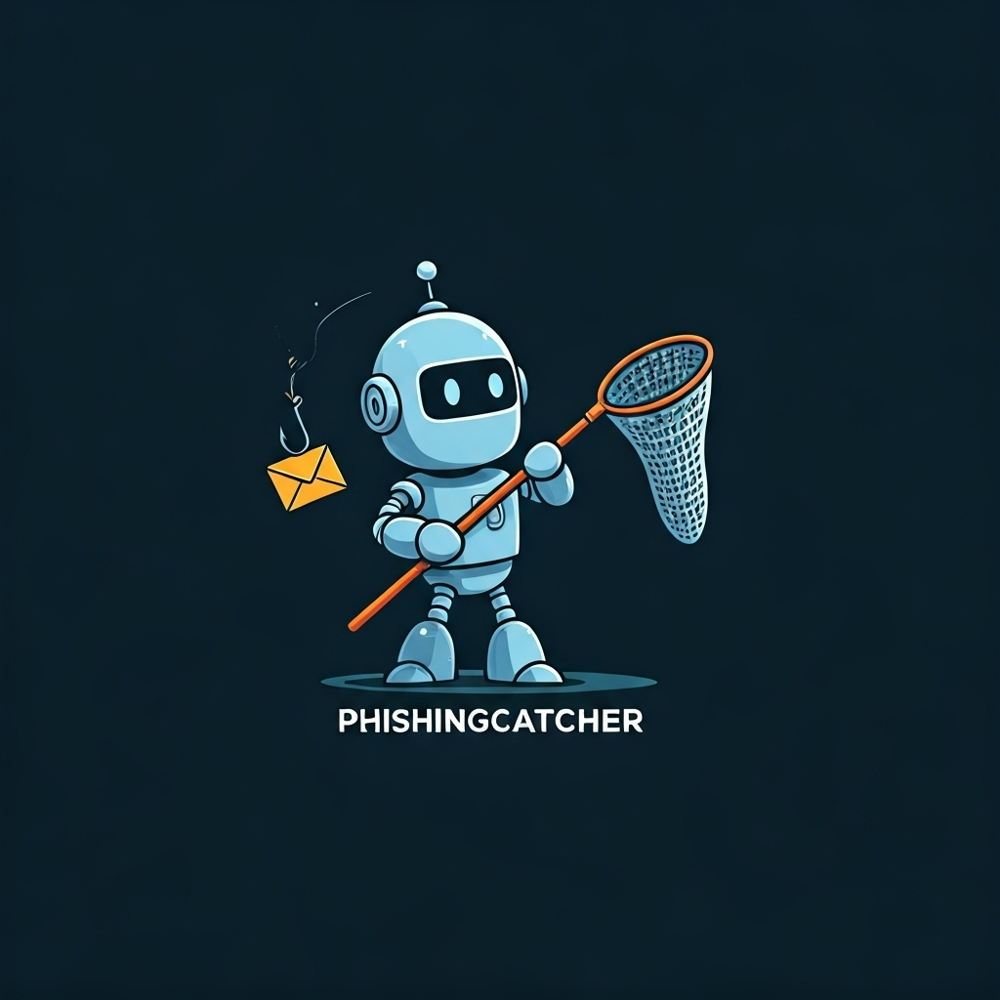

# PhishingCatcher - Analyseur de Phishing Local Augmenté

Un outil d'analyse de phishing sur mesure, rapide et sécurisé avec intelligence artificielle locale intégrée.

## Concept

PhishingCatcher applique le principe de **confiance zéro** à l'analyse de phishing. Contrairement aux services en ligne, tout le traitement se fait en local, garantissant la confidentialité totale des données analysées.

## Architecture Modulaire

### Module 1 : Ingestion et Parsing d'email
- Support des formats `.eml` (`.msg` temporairement désactivé)
- Extraction des en-têtes, corps, URLs et pièces jointes
- Interface drag & drop intuitive

### Module 2 : Analyse Statique Intelligente
- Vérification SPF/DKIM/DMARC
- Détection d'usurpation d'identité
- Analyse des URLs (Punycode, sous-domaines suspects)
- Détection de mots-clés de phishing
- Intégration VirusTotal pour la réputation des URLs

### Module 3 : Intelligence Artificielle Locale
- Modèle Phi-3 via Ollama pour analyse sémantique
- Analyse du contenu et des indicateurs de phishing
- Score de risque intelligent

### Module 4 : Sandbox Dynamique
- Environnement isolé Docker pour test des liens
- Surveillance des redirections et captures d'écran
- Conteneurisation sécurisée avec Selenium

### Module 5 : Export et Rapports
- Génération de rapports PDF détaillés
- Export des résultats d'analyse
- Interface moderne et responsive

## Installation

### Prérequis
- Python 3.12+
- Docker (pour la sandbox dynamique)
- Ollama (pour l'IA locale)
- **Clé API VirusTotal** (gratuite) pour l'analyse des URLs et fichiers

### Démarrage Rapide (Windows)
Double-cliquez sur `start.bat` pour un démarrage automatique avec vérifications.

### Installation Express
```bash
# 1. Cloner le repository
git clone https://github.com/servais1983/PhishingCatcher.git
cd PhishingCatcher

# 2. Installer les dépendances
pip install -r requirements.txt

# 3. Configurer Ollama (si pas déjà fait)
ollama pull phi3

# 4. Configurer VirusTotal (RECOMMANDÉ)
cp env.example .env
# Éditez .env avec votre clé API VirusTotal

# 5. Démarrer l'application
streamlit run app.py
```

**Prêt en 5 minutes !** L'application sera accessible sur http://localhost:8501

**Note :** Pour une analyse complète, configurez votre clé API VirusTotal (gratuite) dans le fichier `.env`.

### Installation d'Ollama
```bash
# Windows (avec winget)
winget install Ollama.Ollama

# Ou télécharger depuis https://ollama.ai
```

### Installation du modèle Phi-3
```bash
ollama pull phi3
```

### Installation Complète
```bash
# Cloner le repository
git clone https://github.com/servais1983/PhishingCatcher.git
cd PhishingCatcher

# Créer un environnement virtuel (recommandé)
python -m venv .venv
.venv\Scripts\activate  # Windows
# source .venv/bin/activate  # Linux/Mac

# Installer les dépendances
pip install -r requirements.txt

# Lancer l'application
streamlit run app.py
```

## Fonctionnalités

### Phase 1 (MVP) - Complète
- Parsing d'emails (.eml)
- Analyse des en-têtes (SPF, DKIM, DMARC)
- Extraction et analyse des URLs
- Détection de mots-clés de phishing
- Interface Streamlit moderne
- Vérification VirusTotal des URLs

### Phase 2 - IA Locale - Complète
- Modèle IA local (Phi-3 via Ollama)
- Analyse sémantique avancée
- Score de risque intelligent
- Détection d'indicateurs de phishing

### Phase 3 - Sandbox Dynamique - Complète
- Sandbox Docker sécurisée
- Analyse des redirections
- Captures d'écran des pages
- Surveillance des téléchargements
- Environnement isolé

### Phase 4 - Export et Rapports - Complète
- Génération de rapports PDF
- Export des résultats
- Interface utilisateur moderne
- Analyse des pièces jointes

## Sécurité

- **Traitement 100% local** : Aucune donnée envoyée à l'extérieur
- **Environnement isolé** : Sandbox Docker pour les tests dynamiques
- **Confidentialité garantie** : Respect du RGPD et des politiques de sécurité
- **Dockerfile sécurisé** : Image Python 3.12 avec utilisateur non-root
- **Dépendances à jour** : Versions sécurisées de toutes les bibliothèques
- **Clés API sécurisées** : Placeholders dans le code, configuration via .env
- **Repository sécurisé** : .gitignore pour exclure les fichiers sensibles

## Stack Technique

- **Backend** : Python 3.12+
- **IA/ML** : Ollama + Phi-3
- **Interface** : Streamlit
- **Sandbox** : Docker (Python 3.12-slim), Selenium 4.15
- **Analyse** : email, beautifulsoup4, requests
- **Export** : FPDF2
- **Sécurité** : urllib3, dnspython, utilisateur non-root

## Dockerfile - Sandbox Sécurisée

Le `Dockerfile` est un composant essentiel de PhishingCatcher qui crée un **environnement d'analyse isolé et sécurisé** pour tester les URLs suspectes.

### Utilité principale
- **Isolation complète** : Les tests d'URLs se font dans un conteneur Docker séparé
- **Sécurité renforcée** : Environnement isolé du système hôte
- **Analyse dynamique** : Test en temps réel des liens de phishing
- **Captures d'écran** : Génération automatique de screenshots des pages

### Fonctionnalités du Dockerfile

#### Environnement sécurisé
```dockerfile
# Image Python 3.12-slim optimisée
FROM python:3.12-slim

# Utilisateur non-root pour la sécurité
RUN groupadd -r appuser && useradd -r -g appuser appuser
USER appuser
```

#### Navigateur automatisé
```dockerfile
# Installation de Google Chrome pour l'analyse
RUN wget -q -O - https://dl.google.com/linux/linux_signing_key.pub | gpg --dearmor -o /usr/share/keyrings/google-chrome.gpg
RUN apt-get install -y google-chrome-stable
```

#### Outils d'analyse
```dockerfile
# Selenium pour l'automatisation web
RUN pip install selenium==4.15.0 webdriver-manager==4.0.2
```

### Fonctionnement

1. **Déclenchement** : Quand PhishingCatcher détecte une URL suspecte
2. **Création du conteneur** : Docker lance une instance du sandbox
3. **Analyse dynamique** : Le conteneur visite l'URL et analyse :
   - Redirections et finalités
   - Contenu de la page
   - Captures d'écran
   - Comportements suspects
4. **Nettoyage** : Le conteneur est automatiquement supprimé après analyse

### Avantages de sécurité
- **Isolation** : Aucun impact sur le système hôte
- **Utilisateur non-root** : Droits limités dans le conteneur
- **Nettoyage automatique** : Pas de traces après analyse
- **Versions sécurisées** : Dépendances à jour et vérifiées

### Exemple d'utilisation
```python
# Dans app.py - Analyse d'URL suspecte
def analyze_url_dynamically(url):
    # Lancement du conteneur Docker
    container = client.containers.run(
        "phishing-sandbox:latest",
        command=f"python sandbox_script.py {url}",
        detach=True,
        remove=True  # Auto-nettoyage
    )
    # Analyse des résultats...
```

## Exemple d'utilisation - Testé et Validé

1. **Démarrage** : Lancez `streamlit run app.py`
2. **Upload** : Déposez un fichier `.eml` suspect dans l'interface
3. **Analyse automatique** : PhishingCatcher analyse :
   - Les en-têtes d'authentification (SPF/DKIM/DMARC)
   - Les URLs et leur réputation (VirusTotal)
   - Le contenu sémantique (IA Phi-3)
   - Les indicateurs de phishing
   - Les pièces jointes
   - Les redirections (sandbox dynamique)
4. **Rapport** : Recevez un rapport PDF détaillé avec score de risque

### Résultats de test réels
- **Email de phishing détecté** : Classification "PHISHING" 
- **URL malveillante** : `https://microsoft-verify-secure.com/login` détectée
- **Usurpation d'identité** : Microsoft correctement identifié
- **Sandbox dynamique** : Fonctionnelle (erreur DNS normale pour URL inexistante)
- **Export PDF** : Généré avec succès
- **Interface** : Moderne et responsive

## Résolution des problèmes

### Erreur "ModuleNotFoundError: No module named 'ollama'"
```bash
pip install ollama
```

### Erreur "ModuleNotFoundError: No module named 'selenium'"
```bash
pip install selenium==4.15.0
```

### Erreur "ModuleNotFoundError: No module named 'docker'"
```bash
pip install docker>=6.1.0
```

### Ollama non trouvé
- Installez Ollama depuis https://ollama.ai
- Tirez le modèle : `ollama pull phi3`

### Docker non disponible
- Installez Docker Desktop
- Assurez-vous que Docker est démarré

### Erreur VirusTotal "Clé API non configurée"
- Obtenez votre clé API gratuite sur [VirusTotal](https://www.virustotal.com/gui/join-us)
- Créez un fichier `.env` avec `VIRUSTOTAL_API_KEY=votre_cle_ici`
- Ou modifiez directement `app.py` ligne 21

## Configuration

### Clé API VirusTotal - REQUISE pour l'analyse des URLs et fichiers

**⚠️ IMPORTANT :** Sans cette clé, les fonctionnalités VirusTotal ne fonctionneront pas !

#### Méthode 1 - Fichier .env (RECOMMANDÉ)

1. **Obtenez votre clé API gratuite :**
   - Allez sur [VirusTotal](https://www.virustotal.com/gui/join-us)
   - Créez un compte gratuit
   - Récupérez votre clé API dans votre profil

2. **Configurez la clé :**
   ```bash
   # Copiez le fichier d'exemple
   cp env.example .env
   
   # Éditez le fichier .env
   # Remplacez "your_virustotal_api_key_here" par votre vraie clé
   ```

3. **Exemple de fichier .env :**
   ```
   VIRUSTOTAL_API_KEY=a1b2c3d4e5f6g7h8i9j0k1l2m3n4o5p6q7r8s9t0
   ```

#### Méthode 2 - Modification directe du code

**Fichier à modifier :** `app.py` (ligne 21)

```python
# Ligne 21 dans app.py
VT_API_KEY = os.getenv('VIRUSTOTAL_API_KEY', "VOTRE_CLE_API_VIRUSTOTAL_ICI")
# Remplacez par :
VT_API_KEY = "votre_cle_api_ici"
```

#### Vérification de la configuration

Après configuration, l'application affichera :
- ✅ **"VirusTotal configuré"** si la clé est valide
- ⚠️ **"Configuration VirusTotal requise"** si la clé n'est pas configurée

#### Sécurité

- **Ne partagez JAMAIS votre clé API**
- **N'ajoutez pas la clé dans les commits Git**
- **Le fichier `.env` est automatiquement ignoré par Git**
- **Utilisez toujours la méthode .env en production**

### Ports utilisés
- **Streamlit** : 8501 (par défaut)
- **Docker** : Ports dynamiques pour la sandbox

## Contribution

Ce projet est en développement actif. Les contributions sont les bienvenues !

### Comment contribuer
1. Fork le projet
2. Créez une branche feature (`git checkout -b feature/AmazingFeature`)
3. Committez vos changements (`git commit -m 'Add some AmazingFeature'`)
4. Push vers la branche (`git push origin feature/AmazingFeature`)
5. Ouvrez une Pull Request

## Licence

MIT License - Voir le fichier LICENSE pour plus de détails.

## Changelog

### Version 2.1.0 (Actuelle) - Testé et Fonctionnel
- Correction complète des vulnérabilités Docker
- Mise à jour vers Python 3.12
- Dockerfile sécurisé avec utilisateur non-root
- Fichier .dockerignore pour la sécurité
- Intégration complète d'Ollama + Phi-3
- Sandbox dynamique fonctionnelle (testée avec succès)
- Export PDF sans erreurs
- Interface Streamlit moderne
- Support VirusTotal (clé API sécurisée)
- Correction des dépendances manquantes
- Détection de phishing testée et validée
- Sécurisation des clés API (placeholder)
- Repository GitHub prêt à l'utilisation

### Version 1.0.0
- MVP avec parsing d'emails
- Analyse statique basique

---

## Optimisations Récentes

### Nettoyage du Code
- **Dépendances optimisées** : Suppression des bibliothèques inutilisées (gradio, pandas, numpy, plotly, matplotlib, html2text, click, tqdm)
- **Structure simplifiée** : Suppression du dossier `src/` inutilisé
- **Fichier de démarrage** : Ajout de `start.bat` pour Windows avec vérifications automatiques
- **Sécurité renforcée** : Ajout de `temp_email_file` au `.gitignore`

### Démarrage Simplifié
Le fichier `start.bat` automatise :
- Vérification de Python 3.12+
- Installation automatique des dépendances
- Vérification d'Ollama et Docker
- Démarrage de l'application Streamlit

## Statut du projet : Prêt pour la Production

### PhishingCatcher v2.1.0 est maintenant :
- **Fonctionnel** : Toutes les fonctionnalités testées et validées
- **Sécurisé** : Vulnérabilités corrigées, clés API protégées
- **Optimisé** : Code nettoyé et dépendances minimales
- **Documenté** : README complet avec instructions d'installation
- **Prêt à l'usage** : Repository GitHub configuré et opérationnel

### Prochaines étapes possibles :
- Déploiement en production
- Tests avec d'autres types d'emails de phishing
- Amélioration de l'interface utilisateur
- Ajout de nouveaux modèles IA
- Intégration avec d'autres outils de sécurité

### Support :
Pour toute question ou problème, ouvrez une issue sur GitHub. 
