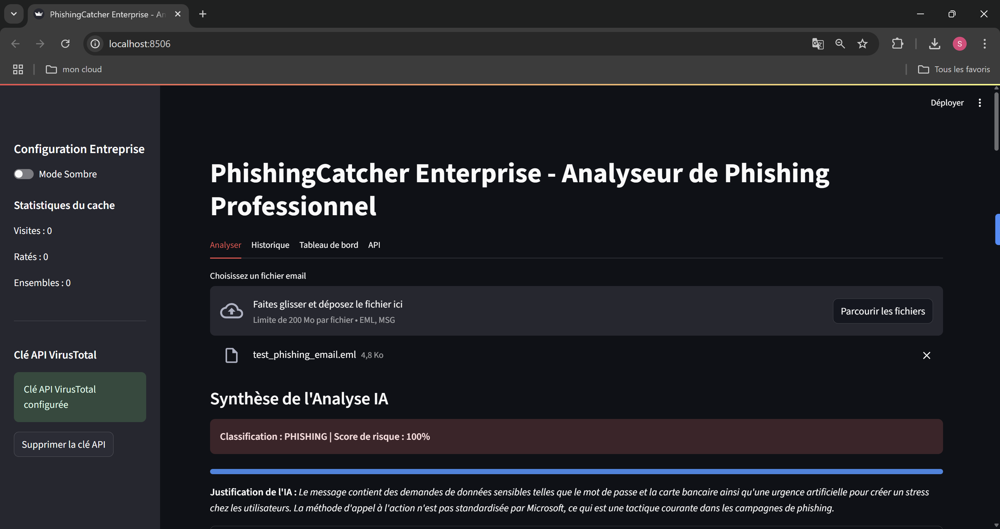

# PhishingCatcher

**Local Phishing Analyzer with AI and Threat Intelligence**

A comprehensive phishing analysis tool that combines local artificial intelligence (Phi-3 via Ollama), dynamic sandbox analysis, and threat intelligence via VirusTotal.


## Interface Preview



## 🚀 Features

### Complete Email Analysis
- **Advanced parsing** : Support for `.eml` and `.msg` formats
- **Intelligent extraction** : URLs, attachments, security headers
- **Header analysis** : SPF, DKIM, DMARC, transmission path

### Local Artificial Intelligence
- **Phi-3 Model** : Semantic content analysis with Ollama
- **Automatic classification** : Phishing, Spam, Legitimate
- **Risk scoring** : Assessment from 0 to 100%
- **AI justification** : Detailed explanation of decisions

### Dynamic Analysis (Sandbox)
- **Isolated environment** : Secure Docker container
- **Automatic navigation** : Selenium with headless Chrome
- **Screenshot capture** : Final rendering visualization
- **Redirect detection** : Malicious URL tracking
- **Network metadata** : IP, geolocation, certificates

### Threat Intelligence
- **VirusTotal integration** : URL and file analysis
- **Global database** : 70+ antivirus engines
- **Real-time detection** : Instant results
- **Direct links** : Access to complete reports

### Professional Reports
- **PDF export** : Detailed and structured reports
- **Compromise indicators** : Centralized IOCs
- **Complete metadata** : Technical information
- **Standardized format** : SOC tool compatible

### Enterprise Features
- **Intelligent caching** : Performance optimization
- **Reputation analysis** : WHOIS, IP geolocation, domain age
- **Advanced pattern detection** : Urgency, financial, authority patterns
- **Behavioral analysis** : Anomaly detection and scoring
- **SQLite database** : Analysis history and statistics
- **Data encryption** : Fernet for sensitive data
- **Audit logging** : Complete action traceability
- **Dark/Light mode** : Professional interface
- **REST API** : Simple API for integration

## 📋 Prerequisites

- **Python 3.12+**
- **Docker Desktop** (for dynamic analysis)
- **Ollama** (for local AI)
- **VirusTotal API key** (free)

## 🛠️ Installation

### Quick Start (Windows)

1. **Download the project** :
   ```bash
   git clone https://github.com/your-username/PhishingCatcher.git
   cd PhishingCatcher
   ```

2. **Install dependencies** :
   ```bash
   pip install -r requirements.txt
   ```

3. **Launch the application** :
   ```bash
   start.bat
   ```

### Manual Installation

1. **Clone the repository** :
   ```bash
   git clone https://github.com/your-username/PhishingCatcher.git
   cd PhishingCatcher
   ```

2. **Create a virtual environment** :
   ```bash
   python -m venv venv
   venv\Scripts\activate  # Windows
   source venv/bin/activate  # Linux/Mac
   ```

3. **Install dependencies** :
   ```bash
   pip install -r requirements.txt
   ```

4. **Configure Ollama** :
   ```bash
   # Install Ollama from https://ollama.ai
   ollama pull phi3
   ```

5. **Start Docker Desktop** (for dynamic analysis)

6. **Launch the application** :
   ```bash
   streamlit run app.py
   ```

## 🔧 Configuration

### VirusTotal API Key

1. **Get a free API key** from [VirusTotal](https://www.virustotal.com/gui/join-us)
2. **Configure in the application** :
   - Use the configuration interface in the sidebar
   - Or create a `.env` file with `VIRUSTOTAL_API_KEY=your_key_here`

### Ollama Setup

1. **Install Ollama** from [ollama.ai](https://ollama.ai)
2. **Download the Phi-3 model** :
   ```bash
   ollama pull phi3
   ```
3. **Start Ollama service** :
   ```bash
   ollama serve
   ```

## 📊 Usage

### Basic Analysis

1. **Launch the application** using `start.bat` or `streamlit run app.py`
2. **Upload an email file** (.eml or .msg format)
3. **Review the analysis results** :
   - AI classification and risk score
   - Security header analysis (SPF, DKIM, DMARC)
   - URL and attachment analysis
   - VirusTotal threat intelligence
   - Dynamic sandbox analysis

### Advanced Features

- **Enterprise Analysis** : Reputation analysis, pattern detection, behavioral analysis
- **History** : View past analyses and statistics
- **Dashboard** : Cache and database statistics
- **API Testing** : Test the REST API interface

### Report Generation

1. **Complete the analysis** to see the full visual report
2. **Click "Generate PDF Report"** to create a downloadable report
3. **Download the PDF** for offline review or sharing

## 📊 Analysis Examples

### Detected Phishing Email
```
Classification : PHISHING | Risk Score : 85%
Justification : Urgent bank account update request
Suspicious URLs : 3 detected
Security Headers : SPF FAIL, DKIM FAIL
VirusTotal : 12 malicious detections
```

### Legitimate Email
```
Classification : LEGITIMATE | Risk Score : 15%
Justification : Official company communication
URLs : 1 legitimate URL detected
Security Headers : SPF PASS, DKIM PASS
VirusTotal : No malicious detections
```

## 🔧 Troubleshooting

### "VirusTotal API key not configured" Error
- Use the configuration interface in the sidebar
- Or manually create a `.env` file
- Get a free key from [VirusTotal](https://www.virustotal.com/gui/join-us)

### "Ollama not accessible" Error
- Verify Ollama is installed and running
- Run `ollama serve` in a terminal
- Check that the `phi3` model is downloaded

### "Docker not available" Error
- Install Docker Desktop
- Ensure Docker is started
- Dynamic analysis will be disabled

### Dependency Issues
   ```bash
   pip install --upgrade pip
   pip install -r requirements.txt --force-reinstall
   ```

## 📁 Project Structure

```
PhishingCatcher/
├── app.py                 # Main Streamlit application
├── start.bat             # Windows startup script
├── requirements.txt      # Python dependencies
├── Dockerfile           # Docker configuration for sandbox
├── sandbox_script.py    # Dynamic analysis script
├── test_phishing_email.eml  # Test email
├── phishing.png         # Project image
├── phish.png           # Interface screenshot
├── README.md           # Documentation
├── .gitignore          # Git ignored files
└── .dockerignore       # Docker ignored files
```

## 🔒 Security

- **Local analysis** : No data sent to external servers
- **Isolated sandbox** : Dynamic analysis in Docker container
- **Secure API keys** : Local storage in `.env` file
- **Input validation** : Protection against injections

## 🤝 Contributing

1. **Fork the project**
2. **Create a branch** : `git checkout -b feature/new-feature`
3. **Commit your changes** : `git commit -am 'Add new feature'`
4. **Push to the branch** : `git push origin feature/new-feature`
5. **Open a Pull Request**

## 📄 License

This project is licensed under the MIT License. See the `LICENSE` file for details.

## 🙏 Acknowledgments

- **Ollama** : For local AI
- **VirusTotal** : For threat intelligence
- **Streamlit** : For the user interface
- **Docker** : For secure dynamic analysis

## 📞 Support

- **GitHub Issues** : [Report a bug](https://github.com/your-username/PhishingCatcher/issues)
- **Discussions** : [Community forum](https://github.com/your-username/PhishingCatcher/discussions)
- **Documentation** : [Project wiki](https://github.com/your-username/PhishingCatcher/wiki)

---

**Project Status** : ✅ Functional | 🔧 Optimized | 📈 Active Development

**Current Version** : 1.0 - Enterprise Features Integrated 
